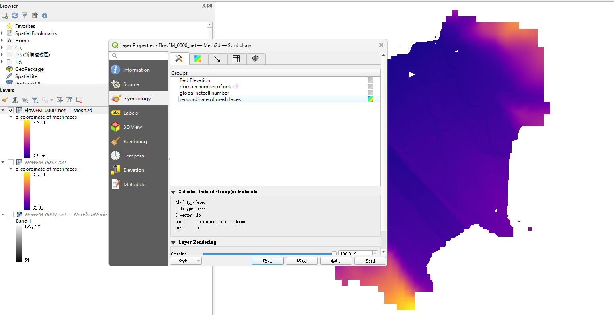

# Delft3D-FM 1D2D

## DEM內插補充說明 (1)

[View PDF](./delft3dfm/DEM內插補充說明.pdf)

---

## DEM內插補充說明 (2)

:::{note .simple}說明
2026.02 版本在完成內插後會將高程資料寫入，網格檔 (_net.nc) 中在完成內插程序後
1. 確認內插成果是否正確可以先輸出 bedlevel。  
2. 確認在 QGIS 中開啟專案內的 _net.nc 使用 UGrid 格式，選取對應參數 z-coordinate of mesh faces 可以正常展示。如果上述兩個步驟都可以完成，表示高程資料已經寫入 *_net.nc 中模擬時可以不用倚賴 .xyz 或 tif 檔案。
:::

---

## DEM內插資料遺失問題

[View PDF](./delft3dfm/DEM內插資料遺失問題.pdf)

---