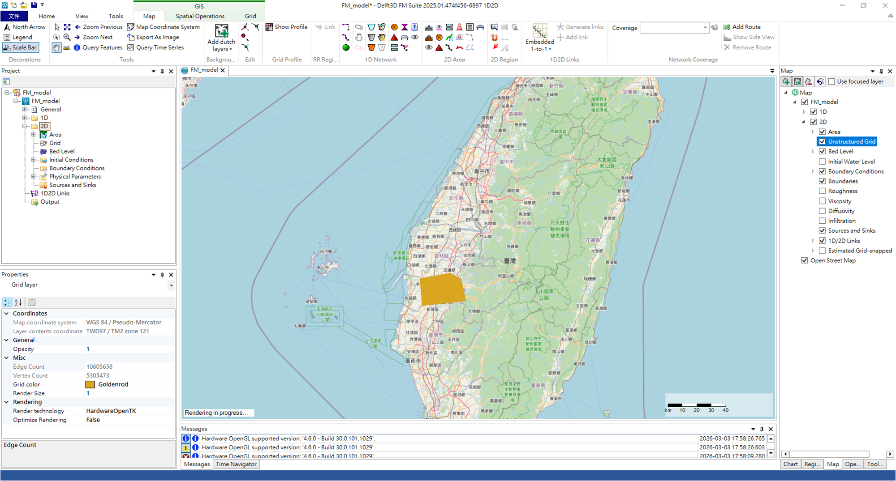

# Delft3D-FM 1D2D GUI

## WMTS 整合
* [Delft3D FM 1D2D 國土測繪中心圖WMTS資整合 WMTS Service Integration](https://tech.fondus.com.tw/AVx985-OSTWk_wfOavCjrw?view)

## 檢視網格數量
在Delft3D FM (D-Flow FM) 介面中，在右邊選擇 Unstructured Grid 
在左側 Project 視窗 Grid layer 
Properties 視窗中查看
Edge Count → 邊數
Vertex Count → 節點數 

